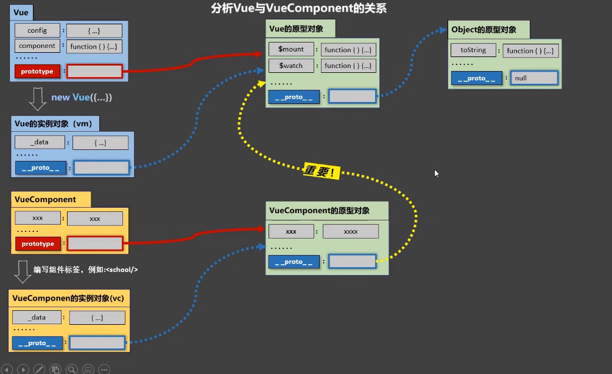

# 组件化

---

* 定义组件
  * 非单文件：`Vue.extend({})`
* 注册组件
  * 在Vue实例`components`配置项中配置
* 使用组件
  * 写组件标签， 例如组件名为`PieChart`，则写`<PieChar></PieChart>`

### 组件命名

### 组件的嵌套

### VueComponent构造函数 
 
### Vue与VueComponent的内置关系
  
`VueComponent.prototype.__proto__ === Vue.prototype `


Vue与VueComponent的关系

### 单文件组件

```vue
<template>
  <!--...组件的结构-->
</template>

<script >
// ... 组件交互相关的代码
// 此处省略了 Vue.extend()
  export default {
    data(){
      return {
        
      }
    },
    methods: {
      
    }
  }
</script>

<style>
/* ... 组件的样式 */
</style>
```
